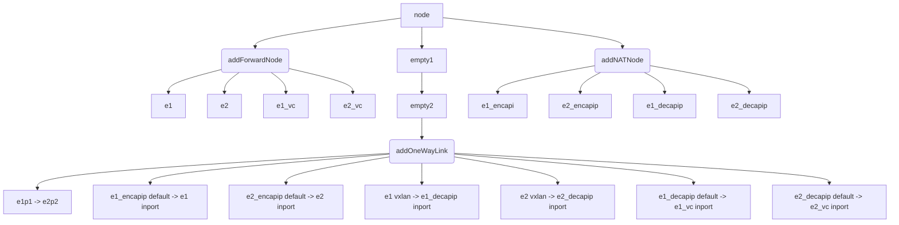
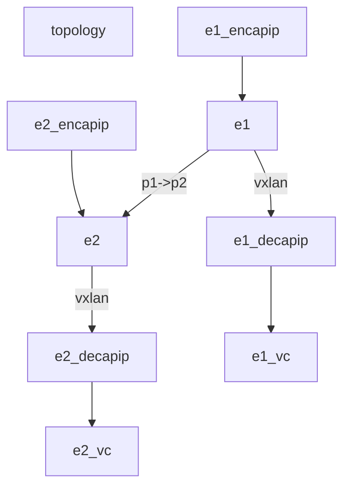
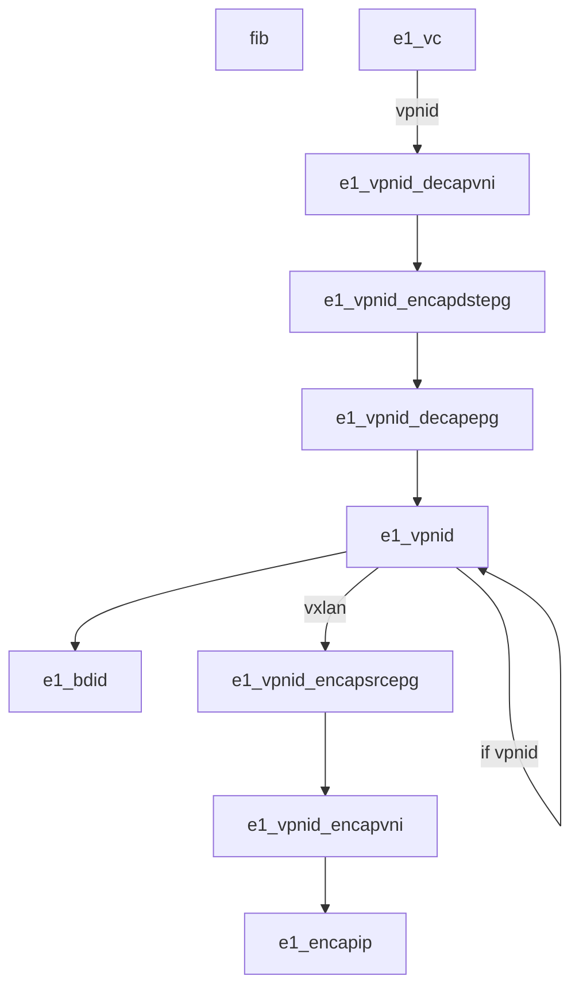
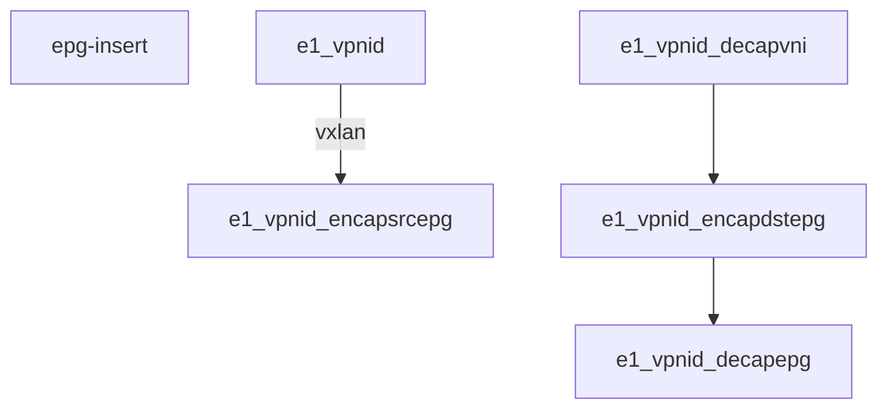
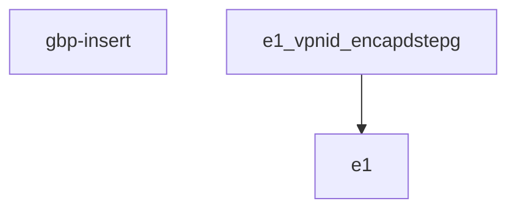
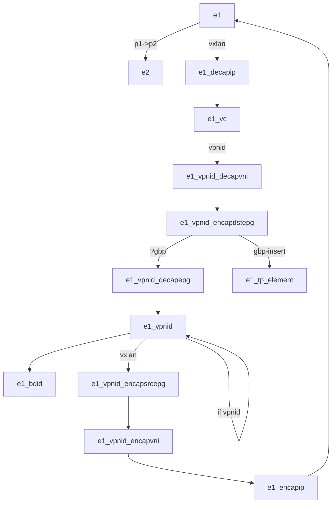

* fwd_rules: ip -> element_name -> (op, outport)
* nve_table: nve -> vpn
* vni_table: vpn -> vni
* ip_encap_rules: vpn -> inner_ip -> (op, outter_ip)
  * e1_encapip
* epg_table: vpn -> epg_id -> (op, ip)
* gbp_rules: srcEPG/dstEPG -> policy -> (op, port)
* acl_rules: element -> rule

e1_vpnid [start]

1. to e1_vpnid 2
2. to e1_vpnid_encapsrcepg

encapsrcepg:
src -> epg(group id)

encapvni:
match ? action encap vni

encapip:
match overlay ip action encap underlay ip

e1:
physical link to other element

e2:
match vxlan action decapip

decapip:

vc:
match vni

访问控制
encapdstepg:
overlay dstip -> dstepg

gbp ?= acl permit deny
check src_epg dst_epg

---

* vrf_each_leaf = 20
* leaf_num: 20

leaf-0-i

spine-0-0

spine-0-1

10ge1/0/0

10ge1/0/1

10ge1/0/i

* leaf-0-i 10ge1/0/0 <-> spine-0-0 10ge1/0/i
* leaf-0-i 10ge1/0/1 <-> spine-0-1 10ge1/0/i

core-0-i

spine-0-0

spine-0-1

40ge1/0/0

40ge1/0/1

40ge1/0/i

* core-0-i 40ge1/0/0 <-> spine-0-0 40ge1/0/i
* core-0-i 40ge1/0/1 <-> spine-0-1 40ge1/0/i

----

num_vpc = leaf

leaf&core: Loopback1 -> vxlan

---

---

---

## Overlay

* available_vpn: [0, ..., num-1]
* getVPC
  * vpc两个一组
  * avl_vpc: [0, ..., num-1]
  * vpc random
* getVRFIP
  * leaf 10.0.x.1/24 每个节点vrf_each_leaf=20个
* getCoreIP
  * core 20.0.x.1/24 每个节点num_vpc=leaf=20个

* vpc_subnet: vpc -> subnet_ip list
* leaf_vpc: id -> vpc list

---

overlay fib

* leaf to leaf
  * ip != subnet_ip
    * fwd leaf-0-i ip 32 device_loopback1_ip 32
    * trans vpn-vpc leaf-0-i ip 32 underlay leaf-0-i device_loopback1_ip 32 32
    * fwd leaf-0-i ip-1 24 device_loopback1_ip 24
    * trans vpn-vpc leaf-0-i ip-1 24 underlay leaf-0-i device_loopback1_ip 32 24
  * ip == subnet_ip
    * fwd leaf-0-i ip 32 vbdif_j 32
    * fwd leaf-0-i ip-1 24 vbdif_j 24
* leaf to core
  * ip != subnet_ip
    * fwd core-0-i ip 32 device_loopback1_ip 32
    * trans vpn-vpc core-0-i ip 32 underlay core-0-i device_loopback1_ip 32 32
    * fwd core-0-i ip-1 24 device_loopback1_ip 24
    * trans vpn-vpc core-0-i ip-1 24 underlay core-0-i device_loopback1_ip 32 24
  * ip == subnet_ip
    * fwd core-0-i ip 32 vbdif_j 32
    * fwd core-0-i ip-1 24 vbdif_j 24

---

overlay topology

overlay_topology: vpc -> {(d, p) -> (d, p)}

* vbdif_j
  * d1, p1 -> d1_bd_j, inport
* device_loopback1_ip
  * leaf
    * d1, p1 -> leaf-0-position, d1_loopback1_ip
    * d1, p1 -> leaf-0-position+1, d1_loopback1_ip
  * core
    * d1, p1 -> core-0-position-num_leaf, d1_loopback1_ip
    * d1, p1 -> core-0-position-num_leaf+1, d1_loopback1_ip

dependency

* vpn-vpc d1 underlay d1

---

MCS topology

* mcs_topology = overlay_topology
  * d2==leaf-0-i
    * d1, p1 -> d2_tp_segment, inport
    * leaves add d2
  * leaves
    * d2_tp_segment, permit -> d2, inport

---

MCS fib

* gbp node epg_src epg_dst permit
* gbp node any any nexthop
